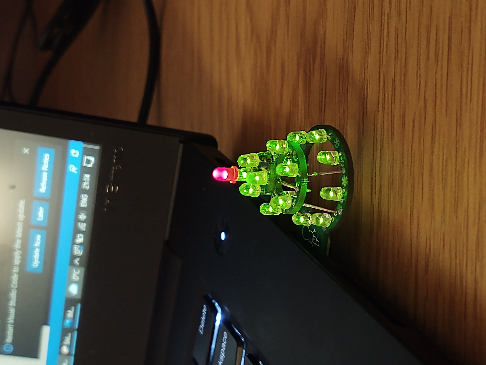
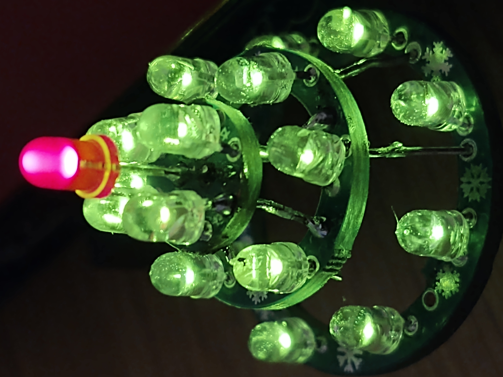
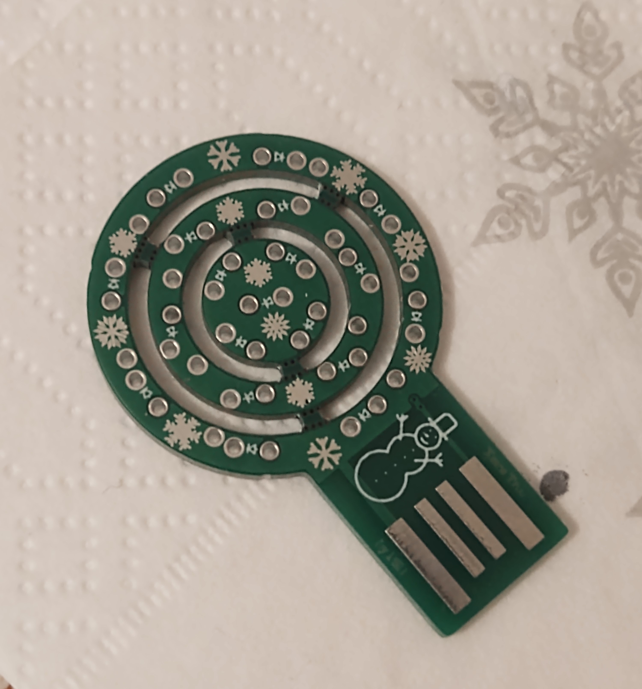
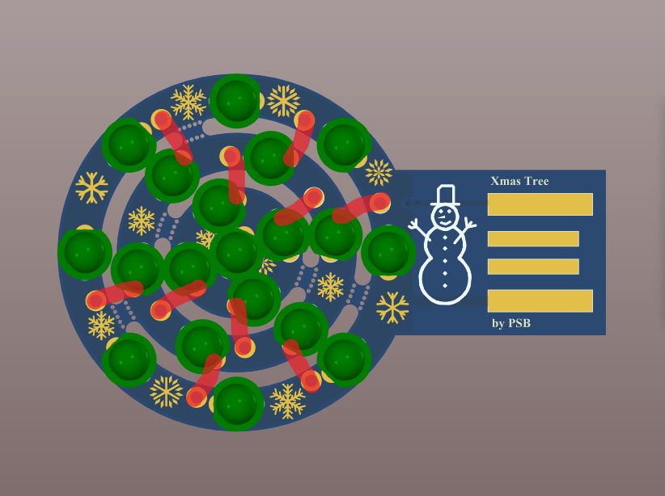
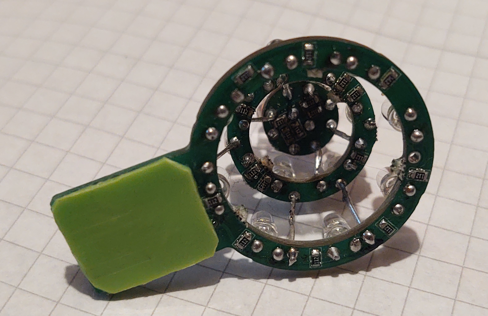

# PSB_Xmas_Tree
PCB Xmas tree with LEDs

This little and fun project was created to bring smile to peoples face durig Xmas.

It is a USB powered, easy to make Christmas tree with minimal number of components.

## List of parts:
- 18x GREEN 3mm, THT LED
- 1x RED 3mm, THT LED
- 19x 1k 0603 resistor
- PCB

PCB was ordered at JLPCB:

LEDs legs are used also as mechanical support connecting layers together and providing power and GND. From each LED one leg needs to be cut short and the other one needs to be soldered to the layer below, because some of the connections are GND and some of them are +5V they can't be missmached, the connections should be as follows:

The PCB is 1.6mm thick, which is not enough for the USB edge connector, this is why on the bottom side of the PCB a plasic psacer needs to be glued. I cut mine from some plastic bottle and used a universal glue.

